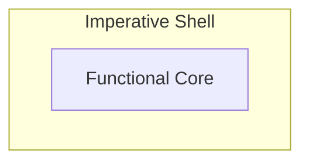

*Combining Pure Functions With Real‑World Side Effects*

# Introduction
This post belongs to the *funkyposts* blog, where I explore functional programming patterns applicable in a C++ environment and grounded in clear code examples.

Functional programming is about utilizing pure functions. By putting the business logic into these functions, which by definition are free of side effects, many things become easier (e.g. testing as described in [[why-functional-programming-caught-me]]). But every real application must still perform effectful operations such as doing IO, updating state, or reacting in a time‑based manner — otherwise the application would be useless. So you might have noticed the elephant in the room: how can effect‑free functions ultimately cause the effects an application must perform?

# The Elephant
The high‑level answer is surprisingly simple: pure functions let someone else perform side effects for them. Therefore, they return data describing what should happen, and their caller interprets them and performs the effects. So, effect‑related behavior still happens—it’s just moved to the call site. For example, a pure function decides to create a log message, and the caller connects to the outside world by printing it to stderr. 

Let’s stay on this higher level and clarify what that means architecturally.

# Functional Core – Imperative Shell
The *functional core – imperative shell* concept formalizes this nicely: an application is split into a functional core (pure business logic) and an imperative shell (which calls the core and performs side effects).

*Imperative Shell*: For a C++ developer this part is familiar. Here anything effectful is allowed: using the standard library to write to stderr, using protocol stacks to communicate with other systems, mutating private members to maintain state, or managing timers. In addition, the shell is responsible for managing the application’s execution environment, such as setting up concurrency. The only constraint: don’t implement business logic here.

*Functional Core*: Every business decision is encoded in pure functions. These functions together form the core. You can compose them freely, while compositions remain pure. This lets you build various layers of abstraction and organize the business logic cleanly.

One important design aspect I want to highlight: the core is self‑contained. So, while the shell depends on the core, the core is independent of the shell. This enables testing the core in complete isolation from any shell.

# Going Deeper?
That’s basically it. Now you know where the boundary lies and how both sides look at an abstract level. Want something more concrete? Check my post [[actors-as-shell]] where I dive into a real‑world code example touching many interesting details.

---
This Post is created with AI assistance for brainstorming and improving formulation. Original and canonical source: https://github.com/mahush/funkyposts Version: v01
