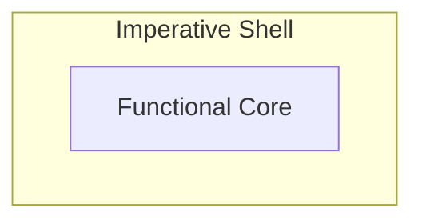

# Handling Side Effects in Modern C++: Designing Systems Around Pure Functions

*Using the functional core–imperative shell pattern*

In the previous [post](bridging-object-oriented-and-functional-thinking-in-modern-cpp), we saw why structuring business logic without side effects—using pure functions—reduces dependencies and makes code easier to reason about and test.

But when applying this idea in a real system, you quickly run into a problem: Although you don't want your functions to have side effects, the application you are building still must perform IO or maintain state to be useful. These concerns introduce dependencies that cannot be eliminated and often make systems harder to reason about.

This leads to a practical design question: how do we structure systems so that these dependencies are handled cleanly outside of the core logic?
## Decoupling Logic and Side Effects
The idea is simple: separate decision-making from effect execution. So, instead of mixing business logic and side effects in the same place, one part of the system focuses on logic, while another handles side effects.

In this setup the logic still determines which effects should happen, but without performing them directly. Instead, it describes what needs to happen, and the surrounding code interprets these results and performs the effects.

If this reminds you of the command pattern, you’re not wrong—but here it’s about how you organize the system. And this is exactly the separation that structuring logic as pure functions naturally leads to.

 For example, a pure function decides to create a log message, and the caller interacts with the outside world by printing it to stderr.
## The Functional Core–Imperative Shell Pattern
This simple structure is called *functional core–imperative shell*. It splits an application into a functional core (pure business logic) and an imperative shell (which calls the core and performs side effects).



**Imperative Shell**: For a C++ developer this part is familiar. Here anything effectful happens: using the standard library to write to stderr, using protocol stacks to communicate with other systems, mutating private members to maintain state, or managing timers. In addition, the shell is responsible for managing the application’s execution environment, such as setting up concurrency. The only constraint is: don’t implement business logic here.

**Functional Core**: Every business decision is encoded in pure functions. These functions together form the core. You can compose them freely, while these compositions remain pure. This lets you build various layers of abstraction and organize the business logic cleanly.

One important design aspect is the direction of dependencies: the shell depends on the core, but the core is independent of the shell. This prevents state, IO, or other external concerns from leaking into the business logic and keeps the core self-contained.

This separation changes where dependencies are located. The core logic no longer depends on state, timing, or external systems—it operates purely on input values. All remaining dependencies are contained in the shell, where they are handled explicitly.

As a consequence, reasoning about the logic becomes straightforward, and testing follows naturally: you call the function with input values and verify the result—without heavy mocking, dependency injection, or complex setup.
## Applying the Pattern in C++
Let's look at a simplified C++ example from a snake game to see core and shell clearly. Consider direction change validation — the rule that prevents instantly reversing direction. 

```cpp
enum class Direction { Up, Down, Left, Right };
enum class SoundEffect { None, InvalidInput };

struct EvaluationResult {
    bool direction_changed;
    SoundEffect sound_effect;
};

Direction opposite(Direction d) {
    switch (d) {
        case Direction::Up: return Direction::Down;
        case Direction::Down: return Direction::Up;
        case Direction::Left: return Direction::Right;
        case Direction::Right: return Direction::Left;
    }
    return d;
}

// functional core
constexpr EvaluationResult evaluateDirectionChange(Direction current, Direction requested) {
    if (requested == opposite(current)) {
        return {false, SoundEffect::InvalidInput};
    }

    return {true, SoundEffect::None};
}

// imperative shell
int main() {
    Direction snake_direction = Direction::Right;

    while (true) {
        Direction input = readUserInput();  // effectful

        auto result = evaluateDirectionChange(snake_direction, input); // calling core

        if (result.sound_effect != SoundEffect::None) {
            playSound(result.sound_effect);  // effectful
        }

        if (result.direction_changed) {
            snake_direction = input;  // effectful
        }
    }
}
```

The `evaluateDirectionChange` function is the functional core—it encodes the business rule about the game's behavior on direction changes. Note that it has no dependencies on state or external systems—it operates purely on its input values. 

The `main` function is the imperative shell—it calls the core, interprets the result, and performs side effects like reading user input, playing sound, or mutating the game state. This is where state is maintained and interaction with external systems takes place.

## Recap - What has changed

### For the core

- hidden state is gone
- dependencies on IO / external systems are gone
- state is no longer implicitly accessed
- object/interface/inheritance-based coupling can drop sharply if the logic is expressed as plain functions

So for the core, the dependency situation improves substantially.

### For the shell

- state still exists
- state still evolves
- effect handling still exists
- dependency complexity is not removed, only **pushed outward and localized**

So the shell remains the place where complexity can accumulate.

Post 2 makes hidden dependencies disappear from business logic by separating pure decision-making from effect handling. This does not eliminate state and side effects from the system, but it prevents them from being mixed into the core logic.

The main achievement of functional core / imperative shell is not removing complexity from the whole system, but removing hidden dependency complexity from the business logic and localizing the rest.
## Starting Small Works Well
The *functional core–imperative shell* pattern allows you to clearly distinguish between the imperative and the pure worlds, while having them bridged via simple function calls.

Yes, this is a fundamental shift in how to deal with side effects. But it doesn’t invalidate your existing C++ design. You don't need to start from scratch to shift where effectful behavior takes place. 

This is not an all-or-nothing approach—in practice you can start small. The pattern works also for a subset of your business logic. Take a piece of code and split out the side effects. Already with the first step you gain better testability and reasoning for the resulting pure world code as described in the previous [post](bridging-object-oriented-and-functional-thinking-in-modern-cpp). Then incrementally move more side effects to the edges.
## Where This Leads Next
The *functional core–imperative shell* pattern works well for decoupling business logic from side effects. So our business logic is clean, that's already a great achievement.

All the side effect handling is now centralized in the shell. As the application grows this  still accumulates complexity. Even in a simple snake game, this escalates quickly: handling user input, playing sound, managing the game state, and performing screen IO.

In my next post, I will show how to refine this design further to organize the remaining complexity in a clean way.

---
Part of the *funkyposts* blog — bridging object-oriented and functional thinking in C++.
Created with AI assistance for brainstorming and improving formulation. Original and canonical source: https://github.com/mahush/funkyposts (v04)
