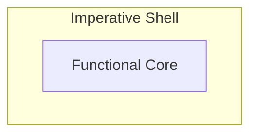

# Handling Side Effects in Modern C++: Interfacing Pure Functions with Our Imperative World

*Introducing the functional core–imperative shell pattern*

The previous [post](bridging-object-oriented-and-functional-thinking-in-modern-cpp) clarified why structuring business logic as pure functions makes code easier to test and reason about. But when you try to utilize pure functions, you quickly run into a problem: Although you don't want your functions to have side effects, the application you are building still must perform effectful operations to be useful. These include IO, updating state, or reacting in a time‑based manner. This leads to a practical question: how can effect‑free functions ultimately cause the effects an application must perform?
## Decoupling Logic and Side Effects
The high‑level answer is surprisingly simple: pure functions let someone else perform side effects for them. Therefore, they return data describing what should happen, and it's the caller that interprets the result and performs the effects. So, effect‑related behavior still happens—it’s just moved to the call site. For example, a pure function decides to create a log message, and the caller interacts with the outside world by printing it to stderr. 

If this reminds you of the command pattern, you’re not wrong—but here it’s about how you organize the system. The key idea is to introduce two complementary worlds: one where pure code requests effects and one where imperative code performs them.
## The Functional Core–Imperative Shell Pattern
This simple structure is called *functional core–imperative shell*. It splits an application into a functional core (pure business logic) and an imperative shell (which calls the core and performs side effects).



**Imperative Shell**: For a C++ developer this part is familiar. Here anything effectful is allowed: using the standard library to write to stderr, using protocol stacks to communicate with other systems, mutating private members to maintain state, or managing timers. In addition, the shell is responsible for managing the application’s execution environment, such as setting up concurrency. The only constraint is: don’t implement business logic here.

**Functional Core**: Every business decision is encoded in pure functions. These functions together form the core. You can compose them freely, while these compositions remain pure. This lets you build various layers of abstraction and organize the business logic cleanly.

One important design aspect I want to highlight: the core is self‑contained. So, while the shell depends on the core, the core is independent of the shell. This enables testing the core in complete isolation from any shell. 

This is exactly where utilizing pure functions pays off: testing becomes straightforward: you call the function with input values and verify the result. There’s no heavy mocking, no dependency injection, and no complex setup.

## Applying the Pattern in C++
Let's look at a simplified C++ example from a snake game to see core and shell clearly. Consider direction change validation — the rule that prevents instantly reversing direction. 

```cpp
enum class Direction { Up, Down, Left, Right };
enum class SoundEffect { None, InvalidInput };

struct EvaluationResult {
    bool direction_changed;
    SoundEffect sound_effect;
};

Direction opposite(Direction d) {
    switch (d) {
        case Direction::Up: return Direction::Down;
        case Direction::Down: return Direction::Up;
        case Direction::Left: return Direction::Right;
        case Direction::Right: return Direction::Left;
    }
    return d;
}

// functional core
constexpr EvaluationResult evaluateDirectionChange(Direction current, Direction requested) {
    if (requested == opposite(current)) {
        return {false, SoundEffect::InvalidInput};
    }

    return {true, SoundEffect::None};
}

// imperative shell
int main() {
    Direction snake_direction = Direction::Right;

    while (true) {
        Direction input = readUserInput();  // effectful

        auto result = evaluateDirectionChange(snake_direction, input); // calling core

        if (result.sound_effect != SoundEffect::None) {
            playSound(result.sound_effect);  // effectful
        }

        if (result.direction_changed) {
            snake_direction = input;  // effectful
        }
    }
}
```

The `evaluateDirectionChange` function is the functional core—it's pure, encoding the business rule about the game's behavior on direction changes. The `main` function is the imperative shell—it calls the core, interprets the result, and performs side effects like reading user input, playing sound, or mutating the game state.

## Starting Small Works Well
The *functional core–imperative shell* pattern allows you to clearly distinguish between the imperative and the pure worlds, while having them bridged via simple function calls.

Yes, this is a fundamental shift in how to deal with side effects. But this approach doesn’t invalidate your existing C++ design. Instead of starting from scratch, it's about shifting where effectful behavior takes place. And, it's not about all or nothing, in practice you can start small. The pattern works also for a subset of your business logic. Take a piece of code and split out the side effects. Already with the first step you gain better testability and reasoning for the resulting pure world code as described in the previous [post](bridging-object-oriented-and-functional-thinking-in-modern-cpp). Then incrementally push more side effects to the edges.
## Where This Leads Next
The *functional core–imperative shell* pattern works well for decoupling business logic from side effects, that problem is solved.

But as applications grow, a new problem appears: the shell starts accumulating unrelated responsibilities. Even in a simple snake game, this escalates quickly: handling user input, playing sound, managing the game state, and performing screen IO all end up in the same place. 

In my next post, I will show how to refine this design further so these responsibilities can be separated cleanly as well.

---
Part of the *funkyposts* blog — blogging to bridge traditional C++ and functional programming by exploring how functional patterns and architectural ideas can be applied in modern C++. Created with AI assistance for brainstorming and improving formulation. Original and canonical source: https://github.com/mahush/funkyposts (v03)
