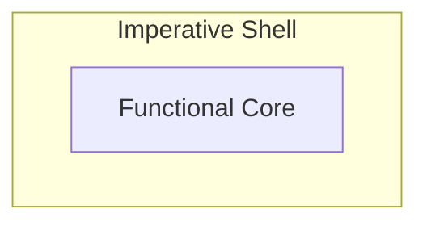

# Handling Side Effects in Modern C++: Designing Systems Around Pure Functions

*Using the functional core–imperative shell pattern*

In the previous [post](bridging-object-oriented-and-functional-thinking-in-modern-cpp), we saw why structuring business logic without side effects—using pure functions—effectively mitigates dependencies and makes code easier to reason about and test.

But applying this idea in a real system isn't straightforward: Although you want your functions without side effects, the application you are building still must perform IO and maintain state to be useful.

This leads to a practical design question: how do we structure systems so that side effects are decoupled from the business logic?
## Decoupling Logic and Side Effects
The key idea is clear separation at the system level. So, instead of mixing business logic and side effects in the same place, one part of the system focuses on logic, while another is dedicated to side effect handling.

In this setup the logic still determines which effects should happen, but without performing them directly. Instead, it describes what needs to happen, and the surrounding code interprets and performs the effects.

If this reminds you of the command pattern, that’s not a coincidence—but here the idea is used to organize the entire system. And this is exactly the separation that structuring logic as pure functions naturally leads to.

 For example, a pure function decides to create a log message, so it returns a string and the caller interacts with the outside world by printing it to stderr.
 
## The Functional Core–Imperative Shell Pattern
This simple structure is called *functional core–imperative shell*: it splits an application into a functional core and an imperative shell.



The **functional core**, is where the business logic is encoded in pure functions. You can wire these functions freely. This lets you build various layers of abstraction and organize the business logic cleanly.

The remaining part forms the **imperative shell** that calls the core and performs effects. For a C++ developer this is familiar terrain: using the standard library to write to stderr, mutating private members, using protocol stacks to communicate with other systems, or managing timers. In addition, the shell is responsible for managing the application’s execution environment, such as setting up concurrency. There is only one constraint: don’t implement business logic here.

One important design aspect is the direction of dependencies: the shell depends on the core, but the core is independent of the shell. This enforces the clean separation as it prevents effects like state, IO, or other external concerns from leaking into the business logic and keeps the core self-contained.

## Applying the Pattern in C++
Let's look at a simplified C++ example from a snake game to see core and shell clearly. Consider direction change validation — the rule that prevents instantly reversing direction. 

```cpp
// functional core
enum class Direction { Up, Down, Left, Right };
enum class SoundEffect { None, InvalidInput };

struct EvaluationResult {
    bool direction_changed;
    SoundEffect sound_effect;
};

Direction opposite(Direction d) {
    switch (d) {
        case Direction::Up: return Direction::Down;
        case Direction::Down: return Direction::Up;
        case Direction::Left: return Direction::Right;
        case Direction::Right: return Direction::Left;
    }
    return d;
}


constexpr EvaluationResult evaluateDirectionChange(Direction current, Direction requested) {
    if (requested == opposite(current)) {
        return {false, SoundEffect::InvalidInput};
    }

    return {true, SoundEffect::None};
}
```
These functions and their input and output types form the *functional core*. Here the business logic about the game's behavior on direction changes is encoded.

```cpp
// imperative shell
int main() {
    Direction snake_direction = Direction::Right;

    while (true) {
        Direction requested_direction = readUserInput();  // effectful

        auto result = evaluateDirectionChange(snake_direction, requested_direction); // calling core

        if (result.sound_effect != SoundEffect::None) {
            playSound(result.sound_effect);  // effectful
        }

        if (result.direction_changed) {
            snake_direction = requested_direction;  // effectful
        }
    }
}
```
The `main` function is the *imperative shell*—it calls the core, interprets the result, and performs side effects like reading user input, playing sound, or mutating the game state.

## Recap - What has changed
The separation into core and shell shifts how business logic is structured and how it interacts with the rest of the system. But let's state it more concretely:
- the business logic no longer performs effects directly but only decides what should happen
- side effect handling (IO, state mutation) is no longer distributed across the business logic but centralized outside of it
- state is no more hidden and implicitly mutated but visible at the top level and explicitly passed into the core and returned

Together, these changes introduce an explicit interface between the pure business logic and the effectful parts of the system at the cost of introducing additional types to describe those effects.

Looking at it through the lens of dependencies from the previous post, the situation improves as follows:
- the business logic has no dependencies on external systems
- fewer places in the system depend on IO or state mutation, and these dependencies are localized instead of spread across the system
- state dependencies are explicit: the business logic depends only on input data passed in and returned, not on internal mutable state

As a consequence, reasoning about the business logic becomes significantly easier, and testing follows naturally: you call the function with input values and verify the result—without heavy mocking, dependency injection, or complex setup. This is exactly the improvement we were aiming for in the previous post.

In addition, effect handling becomes easier to understand and control, as it is no longer spread across the logic but centralized in one place.

So, the main achievement of *functional core–imperative shell* is removing hidden dependencies from the business logic and localizing the remaining ones.

## Starting Small Works Well
Although this is a fundamental shift in how to deal with side effects, it doesn’t require an all-or-nothing redesign. The pattern works for a subset of your business logic, so you can apply it locally, one part of the system at a time: start by moving effectful behavior out of a single piece of business logic while leaving the surrounding structure in place. From there, you can incrementally restructure more of the system step by step.

## Where This Leads Next
All the side effect handling is now centralized in the shell. As the application grows this accumulates complexity there. Even in a simple snake game, this escalates quickly: handling user input, playing sound, managing the game state, and performing screen IO.

In my next post, I will show how to refine this design further to better organize the application to address scaling.

---
Part of the *funkyposts* blog — bridging object-oriented and functional thinking in C++.
Created with AI assistance for brainstorming and improving formulation. Original and canonical source: https://github.com/mahush/funkyposts (v04)
