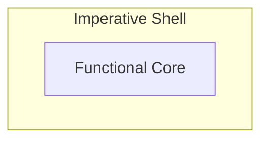

*Introducing the functional core–imperative shell architecture*

## Here Comes the Challenge

Functional programming is about utilizing pure functions. By putting the business logic into these functions, which by definition are free of side effects, many things become easier (e.g., testing as described in [[why-functional-programming-caught-me]]). But every real application must still perform effectful operations such as IO, updating state, or reacting in a time‑based manner — otherwise the application would be useless. So you might have noticed the elephant in the room: how can effect‑free functions ultimately cause the effects an application must perform?

## Addressing the Elephant
The high‑level answer is surprisingly simple: pure functions let someone else perform side effects for them. Therefore, they return data describing what should happen, and their caller interprets them and performs the effects. So, effect‑related behavior still happens—it’s just moved to the call site. For example, a pure function decides to create a log message, and the caller interacts with the outside world by printing it to stderr.

Let’s stay at this higher level and clarify what that means for the architecture.

## Functional Core–Imperative Shell
The *functional core–imperative shell* concept formalizes this nicely: an application is split into a functional core (pure business logic) and an imperative shell (which calls the core and performs side effects).



**Imperative Shell**: For a C++ developer this part is familiar. Here anything effectful is allowed: using the standard library to write to stderr, using protocol stacks to communicate with other systems, mutating private members to maintain state, or managing timers. In addition, the shell is responsible for managing the application’s execution environment, such as setting up concurrency. The only constraint is: don’t implement business logic here.

**Functional Core**: Every business decision is encoded in pure functions. These functions together form the core. You can compose them freely, while these compositions remain pure. This lets you build various layers of abstraction and organize the business logic cleanly.

One important design aspect I want to highlight: the core is self‑contained. So, while the shell depends on the core, the core is independent of the shell. This enables testing the core in complete isolation from any shell.

## Making It Real
Let's look at a concrete C++ example from a snake game. Consider direction change validation — the rule that prevents instantly reversing direction:

```cpp
enum class Direction { Up, Down, Left, Right };

struct EvaluationResult {
    bool accepted;
    std::optional<std::string> logMessage;
};

constexpr Direction opposite(Direction d) {
    switch (d) {
        case Direction::Up: return Direction::Down;
        case Direction::Down: return Direction::Up;
        case Direction::Left: return Direction::Right;
        case Direction::Right: return Direction::Left;
    }
    return d;
}

// functional core
EvaluationResult evaluateDirectionChange(Direction current, Direction requested) {
    if (requested == opposite(current)) {
        return {false, "Cannot reverse direction directly"};
    }

    return {true, std::nullopt};
}

// imperative shell
int main() {
    Direction snake_direction = Direction::Right;

    while (true) {
        Direction input = readInput();  // effectful: read from keyboard

        auto result = evaluateDirectionChange(snake_direction, input);

        if (result.logMessage) {
            std::cerr << *result.logMessage << "\n";  // effectful: write to stderr
        }

        if (result.accepted) {
            snake_direction = input;  // effectful: mutate state
        }
    }
}
```

The `evaluateDirectionChange` function is the functional core—it's pure, encoding the business rule about valid direction changes. The `main` function is the imperative shell—it calls the core, interprets the result, and performs side effects like reading input, logging errors, or mutating the game state.

## Going Deeper?
That’s basically it. Now you know where the boundary lies and how both sides look at an abstract level. Want something more concrete? Check my post [[actors-as-shell]] where I dive into a real‑world code example touching many interesting details.

---
Part of the *funkyposts* blog — blogging to bridge traditional C++ and functional programming by exploring how functional patterns and architectural ideas can be applied in modern C++. Created with AI assistance for brainstorming and improving formulation. Original and canonical source: https://github.com/mahush/funkyposts (v01)
