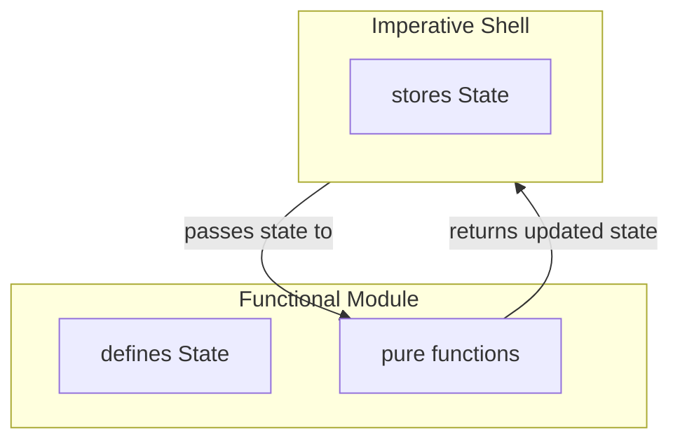

# Mastering State in Modern C++: Making It Encapsulated

**Explicit state without polluting the domain model**

[Previously](mastering-state-in-modern-cpp-making-it-explicit), we made state explicit by assigning state evolution to the core and state persistence and mutation to the shell. This made state visible at the highest level, and changing it required explicit passing between shell and core. 

So far, we looked at state that had meaning at the domain level. The shell knew about snakes and food, and passed them around intentionally. But some state is not part of the domain story: a parser may need to remember where it is in an input stream, or a cache may need to remember previous lookups.

Handling such internal details the same way as regular domain state would pollute the domain model. Worse, unrelated logic could start depending on these details unintentionally. The system would still be explicit, but internal implementation details would start leaking into the surrounding domain model.

In object-oriented C++, we would usually solve this by putting the state behind a class interface. But if we want to keep the functional mechanics from the previous posts, the question becomes more specific:

How do we encapsulate internal implementation details without going back to objects whose behavior depends on hidden mutable state?

This post explores one answer: how pure functions operating on shared module state can form a coherent stateful module — one that keeps state evolution explicit while localizing module-internal state.
## Internal State Modules
The general term *stateful functional module* describes a module that groups a state definition together with pure functions that define how that state evolves. In this post, we focus on one specific variant: the *internal state module*. Its state exists only because the module needs it to implement its internal logic, not because it belongs to the surrounding domain model.

As before, the shell still persists and updates state by replacing the current value with the value returned from a pure function. The difference is not in how the state evolves, but in how the state is treated: it is threaded through the system as module-local implementation state rather than shared domain state.

Treating the state this way creates the module’s encapsulation boundary. The shell passes the state to the module because its type identifies the owning module, not because the shell understands what the state represents. Code outside the module may store and pass the state, but should not depend on its internal structure.



## Looking at Code
Let’s dive into some code from my [funkysnakes](https://github.com/mahush/funkysnakes/tree/v0.1.0) project and see the idea in action.

Snakes are controlled via the arrow keys. But the game loop and key events are asynchronous. At the beginning of each game loop tick, each snake's movement direction is updated based on new key events received since the previous tick. This direction-update logic is implemented in the `direction_command_filter` module. As the name suggests the logic is implemented by filtering key-press events.

Unsurprisingly, this module needs its own internal state: a queue of direction commands per player. This state exists only to implement the filtering logic. It is not part of the game state like snakes, food items, or the board.

```cpp
namespace direction_command_filter {
struct State {
	using PerPlayerDirectionQueue = std::map<PlayerId, std::deque<Direction>>;
	PerPlayerDirectionQueue queues;
};
}
```

The `direction_command_filter` module's interface provides two functions. `tryAdd`, which feeds direction commands into the filter, and `tryConsumeNext`, which retrieves the next direction that passed the filter. Both functions may evolve the module state:

```c++
namespace direction_command_filter {

State tryAdd(State state, const PerPlayerSnakes& snakes, const DirectionCommand& cmd);

std::tuple<State, PerPlayerDirection> tryConsumeNext(State state);
}
```

The regular domain state, `PerPlayerSnakes`, is stored alongside the module-local state, `direction_command_filter::State`:

```c++
namespace shell {
struct GameState {
	...
	PerPlayerSnakes snakes;
	direction_command_filter::State direction_command_filter_state;
};
  
class GameEngineActor : public Actor<GameEngineActor> {
	...
	GameState game_state_;
};
}
```

The `GameEngineActor` then threads the module state through `tryAdd` and `tryConsumeNext`:

```c++
state_.direction_command_filter_state = direction_command_filter::tryAdd(state_.direction_command_filter_state, state_.snakes, new_command);

auto [new_state, direction] =
direction_command_filter::tryConsumeNext(state_.direction_command_filter_state);
state_.direction_command_filter_state = new_state;
```
## Deriving the Module Pattern
This example is concrete, but zooming out reveals the underlying pattern:

```c++
namespace module {

struct State{ ... };

State operation(State state, Input input);
}
```
  
The module defines a state type and a set of pure operations over that state. Each operation receives the current state and returns the updated state.

The namespace forms the module boundary. It groups the state type and the operations that define how this module-local state evolves. In that sense, `module` is self-contained: its behavior can be tested by constructing a `State`, calling its pure functions, and checking the returned state.

The namespace also gives the operations a visible scope, much like a class name would for member functions. Client code calls `module::operation` and stores `module::State`, so the module boundary remains visible at the call site. This also means the state type can simply be called `State`: The required meaning comes from the namespace it belongs to.

Here the shell side at a glance:

```c++
namespace shell {

module::State module_state;

module_state = module::operation(module_state, input);
}
```

The shell persists the current state between calls and threads it through the module operations. It treats the state as module-local implementation state: storing it, passing it, and replacing it with the returned value. This keeps the module’s internal state localized instead of turning it into regular domain state.
## What It Means
Functional design allows broad composition over domain state: pure functions can combine and transform whatever domain data they need. *Internal state modules* introduce a boundary into that otherwise flexible model. Their state remains explicit and still evolves through pure functions, but it stays localized to the module that owns the corresponding implementation logic instead of becoming shared domain data.

When looking at this pattern through the dependency lens, we can see that outside code should depend on the module boundary, not on the module implementation. The shell may store `module::State` and call `module::operation`, and other operations may receive or pass that state as needed. But none of that code should read fields from `module::State` or base decisions on its internal structure. Once surrounding code starts depending on those details, the module’s internals leak into the system. The pattern is meant to prevent exactly that: dependencies on module internals.

In the snake example, `direction_command_filter::State` is module-local state, while `PerPlayerSnakes` is domain state. The filter module owns its internal queue state, but it can still consume domain state as input when needed. This is an important distinction: an *internal state module* is not isolated from the domain. It may use domain state to perform its work, but it does not expose its own implementation state as domain data. This keeps the useful flexibility of sharing domain state across pure functions, while keeping the filter’s internal state localized to the module.

For this kind of module-internal state, conceptual encapsulation is often sufficient. The state is clearly identified as belonging to a specific module, and it has no independent meaning in the domain model. That makes accidental external use less likely than with domain state, where many parts of the system may naturally want to inspect or modify the data. Stronger language-enforced encapsulation is also possible, but it becomes more relevant when domain state itself needs protection — a case we will look at later.

The conceptual encapsulation used here also allows more flexible testing. Tests can still treat the module as a public API and verify behavior through its operations. But when useful, they can also construct relevant states directly, pass them through pure functions, and inspect the returned results without driving an object through long sequences of mutating method calls.

The key idea is this: state evolution remains explicit, but module-internal state stays localized. From the shell’s perspective, module state is treated like a black box: the shell stores it and threads it through module functions, but never peeks inside. As a result, this state does not become part of the surrounding domain model, and outside code does not depend on how the state is represented or what it means internally. The state is visible as a value, but encapsulated as a module-owned concept.
## **State is not mastered yet**
This post covered one side of the *stateful functional module* coin: *internal state modules*. Their purpose is to keep module-internal state explicit without turning it into part of the domain model.

But there is another side to state ownership. Sometimes the state does belong to the domain, but still should not be modified freely because it has invariants or valid transitions.

That is the next step: modeling domain state that must protect its own invariants.

---
This post is created with AI assistance for brainstorming and improving formulation. Original and canonical source: https://github.com/mahush/funkyposts (v01)