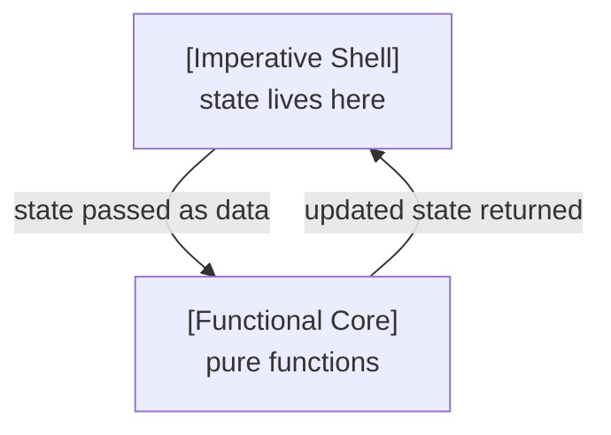

# Mastering State in Modern C++: Making It Explicit

**Passing state as data in the functional core–imperative shell**

In object-oriented systems, logic often depends on state hidden inside objects. At a call site, you typically see only a function and its explicit inputs, not the internal state that may also influence its behavior.

The [functional core – imperative shell](handling-side-effects-in-modern-cpp-designing-systems-around-pure-functions) pattern aims to make such dependencies explicit by separating logic from effects. State is one such effect. But what does that separation mean in practice? How can logic still determine what the next state should be?

Without a clear answer, state easily becomes an implicit dependency again—undermining the very goal of the whole design.

## How State Flows Through Core and Shell
The *functional core – imperative shell* pattern separates logic from side effects. For state, this means that although the logic in the core drives changes, it does not persist or mutate state.

This is resolved by letting state live in the shell, while the core receives it as input and returns updates. So, state evolution follows a clear pattern:
- **persisted and routed by the shell**: the shell holds the current state and passes it as data into a core function  
- **driven by the core**: the core function computes and returns an updated state  
- **mutated by the shell**: the shell applies the returned state  

This way, the logic still determines how state evolves—but without persisting or mutating it.



In consequence, there is a clear responsibility split: the shell owns persistence, routing, and mutation, but not meaning. It may store state, pass selected state into core functions, and replace stored state with returned values. However, it does not interpret the internal structure of that state. The core owns that meaning and therefore evolves state through its logic.

Let’s dive into an example, to see how state flows between shell and core.

## Seeing It in Code
Here is a concrete example from my [funkysnakes github project](https://github.com/mahush/funkysnakes/tree/v0.1.0) that illustrates the pattern clearly. The project implements the actor-based *functional core–imperative shell* architecture introduced in an [earlier post](when-one-shell-isnt-enough-scaling-the-functional-core-imperative-shell-pattern-with-actors-in-cpp). 

In this example, the snakes are part of the game state, and moving them means evolving that state.

The `GameEngineActor`, as shell, holds the `GameState` struct that aggregates the relevant sub-states:
```c++
// Shell: where state is persisted
class GameEngineActor : public Actor<GameEngine> {
  ...
  
  struct GameState {
    PerPlayerSnakes snakes;
    FoodItems food_items;
    Board board;
  };
  GameState state_;
};
```

The core provides the pure function `moveSnakes` depending on the sub-states `snakes`, `board`, and `food_items`. It advances the snakes by one step, returning updated `snakes` while `board` and `food_items` are only read. Another pure function `replenishFood` follows the same pattern.

```c++
// Core: where state evolution is driven
PerPlayerSnakes moveSnakes(PerPlayerSnakes snakes, 
                           const Board& board, 
                           const FoodItems& food_items);

FoodItems replenishFood(FoodItems food_items,
                        const Board& board,
                        const PerPlayerSnakes& snakes);
```

Finally, `moveSnakes` and `replenishFood` are called by the shell within the game loop of the `GameEngineActor`.

```c++
// Shell: where state is mutated
state_.snakes = moveSnakes(state_.snakes, 
                           state_.board, 
                           state_.food_items);

state_.food_items = replenishFood(state_.food_items, 
                                  state_.board, 
                                  state_.snakes);
```

This example maps to the *functional core–imperative shell* design:
- the core is the pure functions `moveSnakes`, `replenishFood`
- the shell is the `GameEngineActor`, which holds and mutates the state  
- both connect at the function call, where the core’s result is applied to the state

One key detail is how state is perceived differently. In the shell, `GameState` persists across calls and is mutated over time—this is what makes it state. In the core, however, there is no notion of state—only data passed in and returned. This is exactly what allows pure functions to drive state changes without mutating state themselves.

The example also reveals a subtle boundary: selecting sub-states is not interpreting them; it is routing. The shell may pick `snakes`, `board`, and `food_items` from `GameState` and pass them to `moveSnakes` or `replenishFood`, but the interpretation of those values remains in the core.

## What This Design Gives You
Looking at the following benefits through the lens of dependencies reveals why they arise:

One key aspect is *transparency*. All state appears at the top level, making it obvious which state exists. State changes are explicit and easy to follow, rather than scattered deep inside objects as is often the case in nested OOP designs. What makes this possible is that state dependencies are no longer hidden, but explicit.

There is also high _flexibility_ in which state can be processed by which function. Here the `snakes` sub-state is updated by `moveSnakes`, while depending on the `board` and the currently existing `food_items`. The same state can also be passed into `replenishFood`, where `food_items` are updated while depending on `board` and `snakes`. So you are free in two directions: each operation can choose the state it depends on or evolves, and generally logic can be sliced into functions as needed because state can always be passed along. New operations can even be added as pure functions over existing state, without changing existing operations. New dependencies may be introduced, but they remain explicit because they are expressed as function parameters.

And another great benefit of this design is that it improves *testability* significantly. As pointed out in the [intro post](bridging-object-oriented-and-functional-thinking-in-modern-cpp), testing stateful code is often complex. To test a specific behavior, you first need to get your software into the right state. This means using the regular API, test-specific APIs, or mocks. This changes when logic no longer depends on hidden internal state, but only on explicit input. With these dependencies exposed, you can simply pass in whatever state you need, making testing straightforward.

In conclusion, all of these benefits stem from the same shift: state dependencies become explicit instead of hidden.

## Where This Reaches Its Limits
So far, we looked at state that can be passed freely through pure functions. Making state explicit gives us transparency, flexibility, and testability. But explicit state alone leaves important ownership questions open.

Some state is an implementation detail—parser state, cache state, or other internals. Making such state explicit should not mean exposing its meaning throughout the surrounding system.

And some state should not be modified freely. Making state explicit should not mean that its evolution can be defined anywhere. State often has invariants or valid transitions that should be preserved consistently.

These concerns lead to additional ways of structuring explicit state. In the next post, we will look at [Encapsulating State Modules](mastering-state-in-modern-cpp-making-it-encapsulated.md): keeping state explicit while localizing its meaning. After that, we will look at [Protecting State Modules](mastering-state-in-modern-cpp-making-it-protected): keeping state explicit while localizing its evolution.

---
This post is created with AI assistance for brainstorming and improving formulation. Original and canonical source: https://github.com/mahush/funkyposts (v03)
