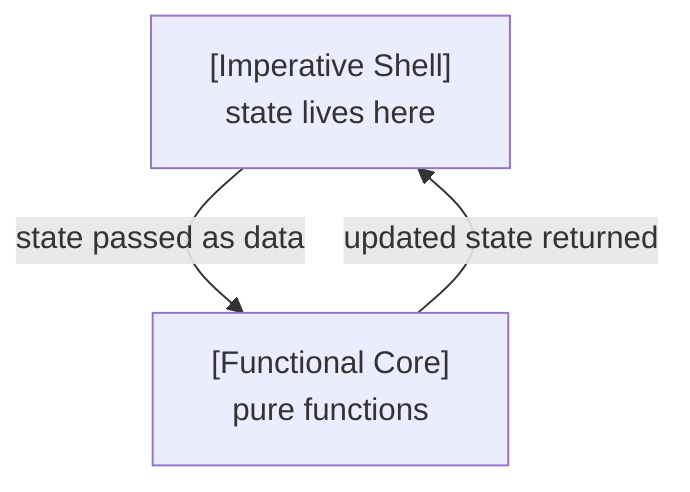

# Mastering State in Modern C++: Making It Explicit

**Passing state as data in the functional core–imperative shell**

In an earlier post, we saw that the _functional core – imperative shell_ pattern reduces complexity by centralizing state mutation in the shell, turning hidden state dependencies into explicit ones.

The underlying idea is simple: keep state out of the business logic. But putting this into practice is not: how can the business logic still evolve state that lives elsewhere—and why does this make dependencies explicit?

Without a clear model at the code level, state easily becomes an implicit dependency again—undermining the whole design.

## How State Flows Through Core and Shell
The *functional core – imperative shell* pattern separates business logic from side effects. State handling is just another side effect. For state, this means that although the business logic in the core drives changes, it does not persist or mutate state.

This is resolved by letting state live in the shell, while the core receives it as input and returns updates. So, state evolution follows a clear pattern:
- **persisted and routed by the shell**: the shell holds the current state and passes it as data into a core function  
- **driven by the core**: the core function computes and returns an updated state  
- **mutated by the shell**: the shell applies the returned state  

This way, the business logic still determines how state evolves—but without persisting or mutating it.



In consequence, there is a clear responsibility split: the shell owns persistence, routing, and mutation, but not meaning. It may store state, pass selected state into core functions, and replace stored state with returned values. But it must not interpret the domain meaning of that state. The core owns that meaning and therefore evolves state through domain decisions.

Let’s dive into an example, to see how state flows between shell and core

## Seeing It in Code
Here is a concrete example from my [funkysnakes github project](https://github.com/mahush/funkysnakes/tree/v0.1.0) that illustrates the pattern clearly. The project implements the actor-based *functional core–imperative shell* architecture introduced in an [earlier post](when-one-shell-isnt-enough-scaling-the-functional-core-imperative-shell-pattern-with-actors-in-cpp). 

In this example, the snakes are part of the game state, and moving them means evolving that state.

The `GameEngineActor`, as shell, holds the `GameState` struct that aggregates the relevant sub-states:
```c++
// Shell: where state is persisted
class GameEngineActor : public Actor<GameEngine> {
  ...
  
  struct GameState {
    PerPlayerSnakes snakes;
    FoodItems food_items;
    Board board;
  };
  GameState state_;
};
```

The core provides the pure function `moveSnakes` depending on the sub-states `snakes`, `board`, and `food_items`. It advances the snakes by one step, returning updated `snakes` while `board` and `food_items` are only read:
```c++
// Core: where state evolution is driven
PerPlayerSnakes moveSnakes(PerPlayerSnakes snakes, const Board& board, const FoodItems& food_items);
```

Finally, `moveSnakes` is called by the shell within the game loop of the `GameEngineActor`:
```c++
// Shell: where state is mutated
state_.snakes = moveSnakes(state_.snakes, state_.board, state_.food_items);
```

This example maps to the *functional core–imperative shell* design:
- the core is the pure function `moveSnakes` and the data structures it operates on  
- the shell is the `GameEngineActor`, which holds and mutates the state  
- both connect at the function call, where the core’s result is applied to the state

One key detail is how state is perceived differently. In the shell, `GameState` persists across calls and is mutated over time—this is what makes it state. In the core, however, there is no notion of state—only data passed in and returned. This is exactly what allows pure functions to drive state changes without mutating state themselves.

The example also reveals a subtle boundary: selecting sub-states is not interpreting them; it is routing. The shell may pick `snakes`, `board`, and `food_items` from `GameState` and pass them to `moveSnakes`, but the interpretation of those values remains in the core.

## What This Design Gives You
Looking at the following benefits through the lens of dependencies reveals why they arise:

One key aspect is *transparency*. All state appears at the top level, making it obvious which state exists. State changes are explicit and easy to follow, rather than scattered deep inside objects as is often the case in nested OOP designs. What makes this possible is that state dependencies are no longer hidden, but explicit.

There's also high *flexibility* in which state can be processed by which function. Here the `snakes` sub-state is mutated, but depends on the `board` and the currently existing `food_items`. Whatever data a pure function needs can simply be passed in by the shell. New domain operations can be added as new pure functions over existing state, without changing the existing operations. This flexibility comes from decoupling logic from stored state and connecting both only through data passed to the function, keeping dependencies simple and explicit.

And another great benefit of this design is that it improves *testability* significantly. As pointed out in the [intro post](bridging-object-oriented-and-functional-thinking-in-modern-cpp), testing stateful code is often complex. To test a specific behavior, you first need to get your software into the right state. This means using the regular API, test-specific APIs, or mocks. This changes when the business logic no longer depends on hidden internal state, but only on explicit input. With these dependencies exposed, you can simply pass in whatever state you need, making testing straightforward.

In conclusion, all of these benefits stem from the same shift: state dependencies become explicit instead of hidden.

## Where This Reaches Its Limits

So far, we looked at domain state that can be passed freely into pure functions: snakes, food items, and the board. But not all state fits that simple model. Two situations need more structure.

First, some state is not domain state at all—parser state, cache state, or other internals. Exposing all of that as top-level state would clutter the domain model with implementation details, making the system harder to reason about. This leads to internal state modules.

Second, some domain state should not be modified freely. If a domain concept has invariants or valid transitions, its evolution may need a clear owner. This leads to domain state modules with protected evolution.

So the next question is how to reintroduce encapsulation without giving up the functional mechanics we established here.

In the [next post](mastering-state-in-modern-cpp-making-it-encapsulated.md), we will look at how to handle *module-internal state* while keeping state evolution explicit and dependencies under control. After that, we will apply the same idea to domain state whose valid evolution needs protection.

---
This post is created with AI assistance for brainstorming and improving formulation. Original and canonical source: https://github.com/mahush/funkyposts (v01)
