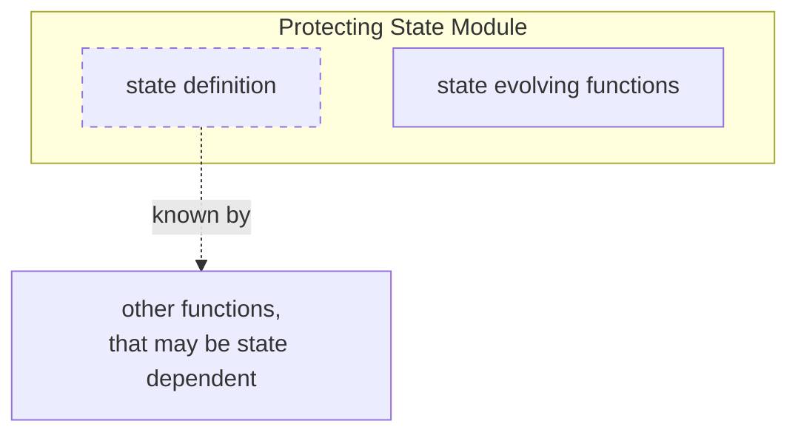

# Mastering State in Modern C++: Making It Protected

**Explicit state with protected evolution**

[Earlier](mastering-state-in-modern-cpp-making-it-explicit), we made state explicit by passing it through pure functions. This naturally allows state and functions to be composed flexibly. Any function can consume or evolve any combination of state, and any piece of state can participate in multiple functions.

But some state must be adjusted carefully. As systems grow, the logic that evolves a piece of state often becomes scattered across the codebase. Different pieces of code start modifying the same state, and those modifications become implicitly dependent on one another. Understanding or changing the evolution of that state then requires reasoning across many locations at once.

A snake body is a simple domain-level example. It must remain a connected chain. Movement must preserve that structure, and dead snakes must not move. If any piece of code can arbitrarily modify body segments, those rules become hard to keep consistent.

The usual object-oriented solution would be to evolve that state through class methods. But we still want state evolution to remain explicit.

How can we protect state evolution without hiding it?
## **Protecting State Modules**
As in a [previous post](mastering-state-in-modern-cpp-making-it-encapsulated), the basic idea is to group state with pure functions over that state into a *Stateful Functional Module*. But this time the focus is different. Previously, the module localized the *meaning* of state. Now it localizes the *evolution* of state.

I call this a Protecting State Module. Its purpose is to protect state evolution by preserving validity over time. That includes what must always be true about the state, and how the state may change. So it becomes useful when a piece of state has invariants or restricted transitions.

As a Protecting State Module owns only state evolution and not state meaning, other functions may depend on the state and build their logic on top of it. The restriction is not about reading, but only about directly modifying it.

Here pattern in a visual nutshell:


## An Example: Protecting Snakes
Let’s return to the _funkysnakes_ project and look at a snake itself.

The game stores snakes as part of its domain model. This makes the concept available throughout the game. To ensure that snake evolution remains valid, snakes are implemented as a *Protecting State Module*, here called `snake_model`.

 The module defines the `Snake` type together with the query functions `head`, `tail` and `alive` to enable read access to the current snake state. This allows any part of the game logic to depend on the concept of a snake in a read only way. 

```cpp
namespace snake::snake_model {

class Snake {
 private:
  Point head_;
  std::vector<Point> tail_;
  bool alive_;

  friend const Point& head(const Snake&);
  friend const std::vector<Point>& tail(const Snake&);
  friend bool alive(const Snake&);

  friend Snake initial(Point, Direction, int);
  friend Snake move(Snake, Direction, const Board&);
  friend Snake kill(Snake);
};

const Point& head(const Snake& s);
const std::vector<Point>& tail(const Snake& s);
bool alive(const Snake& s);

}
```

In addition the module provides the state evolving functions `initial`, `move` and `kill`. So, whenever a snake needs to be modified, these functions are utilized. 

```cpp
namespace snake::snake_model {

Snake initial(Point head, Direction direction, int length);
Snake move(Snake snake, Direction direction, const Board& board);
Snake kill(Snake snake);

}
```

As usual, the shell stores the game state, which includes the snakes.

```cpp
namespace shell {

struct GameState {
	...
	snake_model::Snake snake;
	Direction direction;
	Board board;
};
  
class GameEngineActor : public Actor<GameEngineActor> {
	...
	GameState state_;
};
}
```

Here a piece of logic that is not part of the module but still builds on top of the snake state.

```cpp
bool snakeBitesItself(const snake_model::Snake& snake);
```

In the context of the game loop, the shell triggers evolution of its game state, but the rules for changing the snake are defined by the module. Still other functions like `snakeBitesItself` can depend on snakes.

```cpp
state_.snake = snake_model::move(state_.snake, state_.direction, state_.board);
if (snakeBitesItself(state_.snake)) {
	state_.snake = snake_model::kill(state_.snake);
}
```

## Extracting the Pattern

Generalizing the snake example shows the underlying pattern.

```cpp
namespace protecting_state_module {

class State {
 private:
  int value_;

  friend int value(const State&);
  friend State evolve(State, Input);
};

// query functions
int value(const State& s);

// evolving functions
State evolve(State state, Input input);

}
```

The module defines a state type together with two different types of functions:

*Query Functions* simply provide access to state details. As *Protecting State Modules* share the meaning of its state with the outer world, query functions enable any other function to build on top of its state in a read-only way. This keeps up the flexibility we initially gained with making the state explicit.

*Evolving Functions* allow modification of the state, but only as encoded by these functions. Anyone that holds the state may invoke them. So the flexibility of who may evolve state remains, but the how is encapsulated in the module. This way state evolution is protected. 

The protection is enforced through language-level access control using private data members and a set of friend functions. This matters because meaningful state tends to attract direct modification: once other code can see the representation, it is tempting to adjust it in place. Private data members prevent callers from bypassing the module’s rules.

The tradeoff is that tests can no longer freely construct or modify arbitrary internal states. Instead, they interact with the module through its public state-evolving operations and state queries. Tests apply state changes and verify the resulting behavior through the module’s observable outputs.

## What it means
A _Protecting State Module_ separates code that may evolve state from code that may not. 

By forcing all state-evolving operations into the module, it localizes state evolution. This means that the rules for how state may change are implemented in one place. To understand how state can evolve, you no longer have to track down every function that relates to it. The rules are no longer scattered across the codebase. 

Looking at this through the dependency lens clarifies the effect of the module boundary: outside the module, a state-modifying dependency no longer implicitly means a dependency on how that state evolves. Instead, state-modifying dependencies are limited to requesting state changes through the module’s interface. This leads to an important distinction:
- Dependencies on *triggering* state changes may still be spread throughout the system. Different parts may decide that a snake moves or gets killed. Those are dependencies on the module’s state-evolution interface. 
- In contrast, dependencies on the *evolution logic* itself are localized to the module. The rules that define what moving or killing a snake actually means are concentrated in the module. As a result, reasoning about state evolution becomes much simpler. Instead of considering the entire system, you only need to consider a single module.

Protection is a direct consequence of this localization. Because dependencies on the evolution logic are contained within the module, outside code cannot arbitrarily modify the state. The state is protected because no dependency on its evolution logic can exist outside the module.

Note that there are different aspects to protect. Some modules primarily protect invariants that must always hold. Others primarily define valid transitions between states. Many do both, like the snake example. The `snake_model` defines how a snake may change (`move` or `kill`), while also ensuring that the resulting snake remains valid (keeping its body segments connected).

Even though state evolution is localized, the state itself remains part of the broader system. State changes are protected, but state meaning is not. Therefore read-only dependencies remain meaningful. 

The key takeaway is this: State remains explicit, but the responsibility for evolving it is localized. The state concept may belong to the broader system, while its valid evolution is owned by the module.

## This is how to Master State
Mastering state begins with [making state explicit](mastering-state-in-modern-cpp-making-it-explicit). State becomes visible in the design and flows through the system as data. Functions no longer implicitly depend on hidden mutable state, and state evolution becomes an explicit part of the program structure.

Once state is explicit, a new set of design questions appears:
- Who should understand the meaning of state?
- Who should define how state may evolve?

One answer is an [Encapsulating State Module](mastering-state-in-modern-cpp-making-it-encapsulated). It localizes state meaning. The state remains explicit, but only the module itself interprets it.

Another answer is a _Protecting State Module_. It localizes state evolution. The state remains explicit, but only the module itself defines how it may change.

These concerns are independent. A module may own the meaning of state, the evolution of state, both, or neither.

This is possible because both patterns build on the same underlying mechanism: grouping state with pure functions operating on that state into a module. Whether this results in encapsulation, protection, or both depends on how the state is shared and on the role those functions play. Encapsulating and Protecting State Modules are therefore not competing module types. They are complementary ways of assigning ownership within the same module.

The choice is therefore selective. Such modules become useful only when either the meaning of state or the valid evolution of state needs an owner. Otherwise, state can simply remain explicit.

Ultimately, making state explicit is the foundation. From there, the design challenge becomes deciding whether localizing state meaning or state evolution is worth the additional boundary.