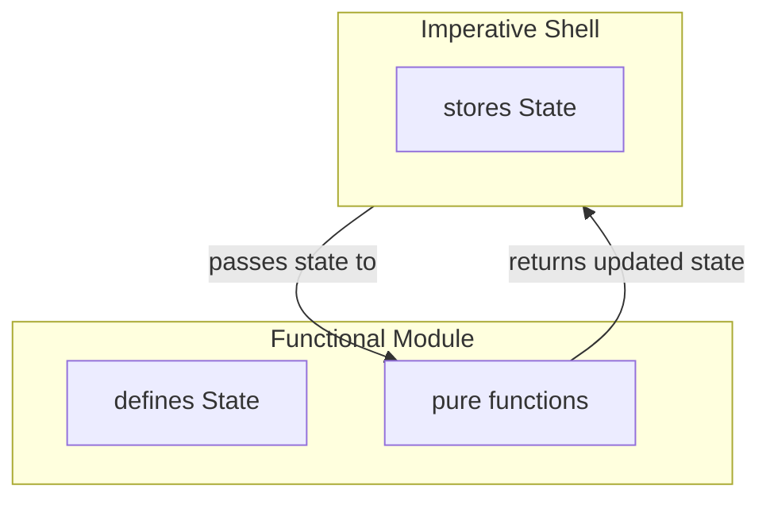

# Mastering State in Modern C++: Making It Encapsulated

**subtitle**

[Previously](mastering-state-in-modern-cpp-making-it-explicit), we made state explicit by assigning state evolution to the core and state persistence and mutation to the shell. This made state visible at the highest level, and changing it required passing it explicitly between shell and core. 

So far, we looked at state that had meaning at the domain level. The shell knew about snakes and food, and passed them around intentionally. But some state is not part of the domain story: a parser may need to remember where it is in an input stream, or a cache may need to remember previous lookups.

Handling such internal details the same way as regular domain state would pollute the domain model. Worse, unrelated logic could start depending on these details unintentionally. The system would still be explicit, but it would no longer be well-encapsulated.

In object-oriented C++, we would usually solve this by putting the state behind a class interface. But if we want to keep the functional mechanics from the previous posts, the question becomes more specific:

How do we introduce encapsulation without going back to objects whose behavior depends on hidden mutable state?

This post explores one answer: how pure functions operating on shared module state can form a coherent stateful module — one that keeps state evolution explicit while properly encapsulating internal details.

## Stateful Functional Modules
The basic idea of a stateful functional module is to group the state definition together with the pure functions that operate on it.

As before, the shell still persists and mutates state by replacing the current value with the value returned from a pure function. But now the state is no longer part of the shell’s domain model. The shell treats it as opaque module state. It passes the state to the module because its type identifies it as that module’s state, not because the shell understands what the state represents. Only the module itself knows its meaning, so nothing outside the module should depend on its internal structure.





## Looking at Code
Let’s dive into some code from my [funkysnakes](https://github.com/mahush/funkysnakes/tree/v0.1.0) project and see the idea in action.

Snakes are controlled via the arrow keys. But the game loop and key events are asynchronous. At the beginning of each game loop tick, each snake's movement direction is updated based on new key events received since the previous tick. This direction-update logic is implemented in the `direction_command_filter` module. As the name suggests the logic is implemented by filtering key-press events.

Unsurprisingly, this logic requires state: a queue of direction commands per player. Thet state looks like this:
```cpp
namespace direction_command_filter {
struct State {
	using PerPlayerDirectionQueue = std::map<PlayerId, std::deque<Direction>>;
	PerPlayerDirectionQueue queues;
};
}
```

The `direction_command_filter` module's interface provides two functions. `tryAdd`, which feeds direction commands into the filter, and `tryConsumeNext`, which retrieves the next direction that passed the filter. Both functions may evolve the module state:
```c++
namespace direction_command_filter {

State tryAdd(State state, const PerPlayerSnakes& snakes, const DirectionCommand& cmd);

std::tuple<State, PerPlayerDirection> tryConsumeNext(State state);
}
```

The `GameEngineActor` stores the regular domain state, `PerPlayerSnakes`, alongside the opaque module state, `direction_command_filter::State`:
```c++
namespace shell {
struct GameState {
	...
	PerPlayerSnakes snakes;
	direction_command_filter::State direction_command_filter_state;
};
  
class GameEngineActor : public Actor<GameEngineActor> {
	...
	GameState game_state_;
};
}
```

The `GameEngineActor` then threads the module state through `tryAdd` and `tryConsumeNext`:

```c++
state_.direction_command_filter_state = direction_command_filter::tryAdd(state_.direction_command_filter_state, state_.snakes, new_command);

auto [new_state, direction] =
direction_command_filter::tryConsumeNext(state_.direction_command_filter_state);
state_.direction_command_filter_state = new_state;
```

## Deriving the Module Pattern
This example is concrete, but zooming out reveals a reusable pattern:

```c++
namespace module {

struct State{ ... };

State operation(State state, Input input);
}
```
  
The module defines a state type and a set of pure operations over that state. Each operation receives the current state and returns the updated state.

```c++
namespace shell {

module::State module_state;

module_state = module::operation(module_state, input);
}
```

The shell persists the current state between calls and threads it through the module operations. It handles the state mechanically: storing it, passing it, and replacing it with the returned value. Only the module interprets the state’s internal structure.

## What it means
As announced, there a some aspects that deserve attention:

*Class Equivalent*: Generally, following this pattern, a stateful class can be converted into a stateful functional module. I feel this is especially helpful as it bridges between the object oriented and the functional world. So when transitioning into functional programming just start with taking your modules with you.

*Self Contained Module*: The code in the `direction_command_filter` namespace make the module. By defining its functions and internal state it's self contained and as such can be unit tested in isolation.

*Namespace Scope*: Note that the namespace gives scope to the functions exactly as a class name would do otherwise. In turn the module boundaries are clearly visible at client side calls. Also it's sufficient to call the module's state simply `State`.

*Effective Encapsulation*: The module's state is only modified by the module's functions themselves. This is the essence of encapsulating state as provided by private class member variables in OOP context. Please note that the shell, which manages the persistence of this module-internal state, does not contradict this, as the shell only applies modification created by the module's functions. The shell does not modify state on its own behalf. From the shell's perspective, module state is a black box, although it stores and threads it through module functions but never peeks inside.

*Testability*: Although the state is encapsulated it's not hidden. When calling the module's pure functions we can easily pass arbitrary state in and observe the resulting state. So testing works the same as described in [[mastering-state-in-modern-cpp-making-it-explicit]], which means stateful modules are perfectly testable. I love it.

*Module Internal State vs Domain Level State*: Notice that `tryAdd` receives two different kinds of state: `direction_command_filter::State` (module internal) and `PerPlayerSnakes` (domain level). Module internal state is data that only the `direction_command_filter` functions understand. In contrast the domain level state has meaning across the entire game domain, so many parts of the system understand what a snake is and operates on this state. The filter module needs to read it (to check current direction) but doesn't own it. This differentiation is quite important as the level defines which functions can interpret the state. The key point here is: domain logic functions must not directly operate on and thus not interpret module internal state. Therefore the internal state's name on domain level is just `direction_command_filter_state` which only indicates that it belongs to the `direction_command_filter` module but effectively hides its internals.

Sharing these different perspectives on that design should help you to get a deeper understanding of the implementation details and their consequences such that you see clearly how to apply this pattern by yourself. 


## Conclusions

OOP naturally provides encapsulation of data in context of functions. Besides many weaknesses of object oriented design I feel this encapsulation generally is really a strength. So I am happy that this idea is compatible with functional programming. To be fair, only the class's data encapsulation is perfect in the sense that there is really no way to access a private member from outside the class (unless you make explicit exceptions via friend declarations). In the presented stateful functional module design the encapsulation is only based on the described discipline but in turn we gain great testability which I feel is a great trade off.

Now it's your turn, give it a try an feel the magic of building a stateful functional module out of stateless functions!

---
This post is created with AI assistance for brainstorming and improving formulation. Original and canonical source: https://github.com/mahush/funkyposts (v01)


---
## **Subtle but important nuance**

The next post does **not** go back to OOP-style encapsulation.

Instead, it introduces:

**functional encapsulation**

Meaning:

- modules _own_ state conceptually
- but don’t _hide_ it structurally

That’s the key idea you’re setting up.


--


Modularity is essential for managing complexity. In the [[actors-as-shell]] post, I discussed this idea in the context of dividing an application at a high level. The same principle applies at lower levels as well—for example, when isolating self-contained pieces of logic into modules. Since logic typically comes with state, encapsulating logic within a module naturally means encapsulating state there too.

Object-oriented programming does exactly this all the time: each class has functions and data these functions are operating on. Data that is mutated becomes state. And so eventually a class encapsulates state. It's something that happens naturally.

I discussed how to generally combine pure functions with state in [[mastering-state-in-modern-cpp-making-it-explicit]], but without any encapsulation. Instead state was publicly available and thus could be mutated by anyone. Sometimes we want this flexibility, but sometimes we only want state to be module local. So, sometimes we want OOP-like encapsulation in a functional programming context. How to get there?

So, this post explores how pure functions operating on a shared state can form a coherent stateful module that effectively encapsulates state.