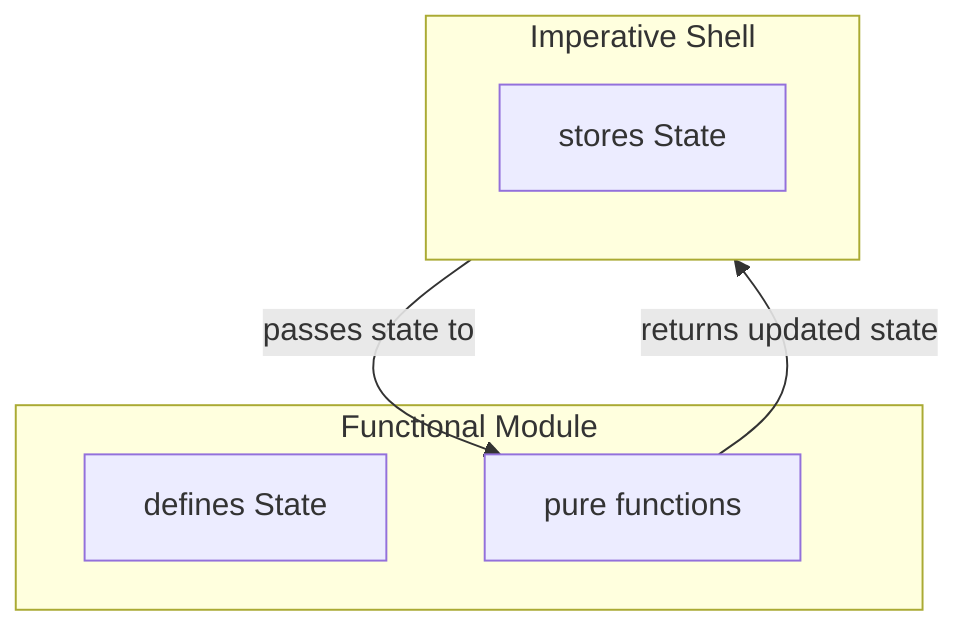

# Mastering State in Modern C++: Making It Encapsulated

**Explicit state, localized meaning**

[Previously](mastering-state-in-modern-cpp-making-it-explicit), we made state explicit by assigning state evolution to the core and state persistence and mutation to the shell. This made state visible at the highest level, and changing it required explicit passing between shell and core. 

So far, we looked at state that had meaning at the domain level. The shell knew about snakes and food, and passed them around intentionally. But some state is not part of the domain story: a parser may need to remember where it is in an input stream, or a cache may need to remember previous lookups.

Handling such internal details the same way as regular domain state would pollute the domain model. Worse, unrelated logic could start depending on these details unintentionally. The system would still be explicit, but it would no longer be well-encapsulated.

In object-oriented C++, we would usually solve this by putting the state behind a class interface. But if we want to keep the functional mechanics from the previous posts, the question becomes more specific:

How do we introduce encapsulation without going back to objects whose behavior depends on hidden mutable state?

This post explores one answer: how pure functions operating on shared module state can form a coherent stateful module — one that keeps state evolution explicit while properly encapsulating internal details.

## Stateful Functional Modules
The basic idea of a stateful functional module is to group the state definition together with the pure functions that operate on it.

As before, the shell still persists and mutates state by replacing the current value with the value returned from a pure function. But now the state is no longer part of the shell’s domain model. The shell treats it as opaque module state. It passes the state to the module because its type identifies it as that module’s state, not because the shell understands what the state represents. Only the module itself knows its meaning, so nothing outside the module should depend on its internal structure.





## Looking at Code
Let’s dive into some code from my [funkysnakes](https://github.com/mahush/funkysnakes/tree/v0.1.0) project and see the idea in action.

Snakes are controlled via the arrow keys. But the game loop and key events are asynchronous. At the beginning of each game loop tick, each snake's movement direction is updated based on new key events received since the previous tick. This direction-update logic is implemented in the `direction_command_filter` module. As the name suggests the logic is implemented by filtering key-press events.

Unsurprisingly, this logic requires state: a queue of direction commands per player. That state looks like this:

```cpp
namespace direction_command_filter {
struct State {
	using PerPlayerDirectionQueue = std::map<PlayerId, std::deque<Direction>>;
	PerPlayerDirectionQueue queues;
};
}
```

The `direction_command_filter` module's interface provides two functions. `tryAdd`, which feeds direction commands into the filter, and `tryConsumeNext`, which retrieves the next direction that passed the filter. Both functions may evolve the module state:

```c++
namespace direction_command_filter {

State tryAdd(State state, const PerPlayerSnakes& snakes, const DirectionCommand& cmd);

std::tuple<State, PerPlayerDirection> tryConsumeNext(State state);
}
```

The `GameEngineActor` stores the regular domain state, `PerPlayerSnakes`, alongside the opaque module state, `direction_command_filter::State`:

```c++
namespace shell {
struct GameState {
	...
	PerPlayerSnakes snakes;
	direction_command_filter::State direction_command_filter_state;
};
  
class GameEngineActor : public Actor<GameEngineActor> {
	...
	GameState game_state_;
};
}
```

The `GameEngineActor` then threads the module state through `tryAdd` and `tryConsumeNext`:

```c++
state_.direction_command_filter_state = direction_command_filter::tryAdd(state_.direction_command_filter_state, state_.snakes, new_command);

auto [new_state, direction] =
direction_command_filter::tryConsumeNext(state_.direction_command_filter_state);
state_.direction_command_filter_state = new_state;
```

## Deriving the Module Pattern
This example is concrete, but zooming out reveals a reusable pattern:

```c++
namespace module {

struct State{ ... };

State operation(State state, Input input);
}
```
  
The module defines a state type and a set of pure operations over that state. Each operation receives the current state and returns the updated state.

The namespace forms the module boundary. It groups the state type and the operations that give this state meaning. In that sense, `module` is self-contained: its behavior can be tested by constructing a `State`, calling its pure functions, and checking the returned state.

The namespace also gives the operations a visible scope, much like a class name would for member functions. Client code calls `module::operation` and stores `module::State`, so the module boundary remains visible at the call site. This also means the state type can simply be called `State`: The required meaning comes from the namespace it belongs to.

On the shell side, the pattern looks like this:

```c++
namespace shell {

module::State module_state;

module_state = module::operation(module_state, input);
}
```

The shell persists the current state between calls and threads it through the module operations. It handles the state as an opaque value: storing it, passing it, and replacing it with the returned value. Only the module interprets the state’s internal structure.

## What It Means

A stateful functional module plays a role similar to a class: it groups state with the operations that give this state meaning. It forms a bridge between object-oriented and functional design: it preserves the class-like idea of grouping state with behavior, while keeping the functional mechanics of explicit state passing and pure transformations.

This is especially useful when moving from object-oriented design toward a more functional style. Existing modules do not have to disappear — they can often be reshaped around explicit state and pure operations.

When looking at this pattern through the dependency lens, we can see that the shell depends on the module boundary, not on the module representation. It stores `module::State` and calls `module::operation`, but it should not read fields from `module::State` or base decisions on its internal structure. Once client code starts reading those details, the module’s internals leak into the surrounding system. The pattern is meant to prevent exactly that: dependencies on module internals.

This is where the difference between module state and domain state matters. `PerPlayerSnakes` is domain-level state. It has meaning across the game domain, so different parts of the system may reasonably understand what a snake is. `direction_command_filter::State`, on the other hand, is module-internal state. It supports the implementation of direction filtering, so only the `direction_command_filter` module should interpret it. The `GameEngineActor` may store that state and pass it to `tryAdd` or `tryConsumeNext`, but it should not inspect the queues inside it. The key point is that domain logic should not directly operate on module-internal state.

This is encapsulation by discipline, not by access control. The module owns the state conceptually, but it does not hide it structurally. C++ does not prevent other code from inspecting `direction_command_filter::State`. At first, that may look weaker than private class members. But it also makes the module easy to test. Tests do not need to drive an object through a long sequence of public method calls just to reach a specific internal situation. They can construct any relevant state directly, pass it to a pure module function, and inspect the returned state.

That does not contradict encapsulation. It is part of the flexibility of the pattern. The same state can be treated differently in different contexts — opaque in production code, inspectable in module tests.

This is the core idea of the pattern: state evolution remains explicit, but interpretation is localized. From the shell’s perspective, module state is treated like a black box: the shell stores it and threads it through module functions, but never peeks inside. Only the module knows what that state means. The state is visible as a value, but encapsulated as a concept.

## Conclusions

Object-oriented C++ gives us strong data encapsulation through private members. Stateful functional modules do not provide the same access-control guarantee. Their encapsulation is based on a design rule: production code treats module state as opaque and only the module interprets it.

In return, state evolution stays explicit. The shell stores and threads the current state, while pure module functions compute the next one. This keeps module-internal state out of the domain model, prevents dependencies on implementation details, and still makes the module easy to test.

So when a piece of logic needs its own state, it does not have to become an object with hidden mutation. It can become a stateful functional module: stateful in what it models, functional in how it evolves.

---
This post is created with AI assistance for brainstorming and improving formulation. Original and canonical source: https://github.com/mahush/funkyposts (v01)