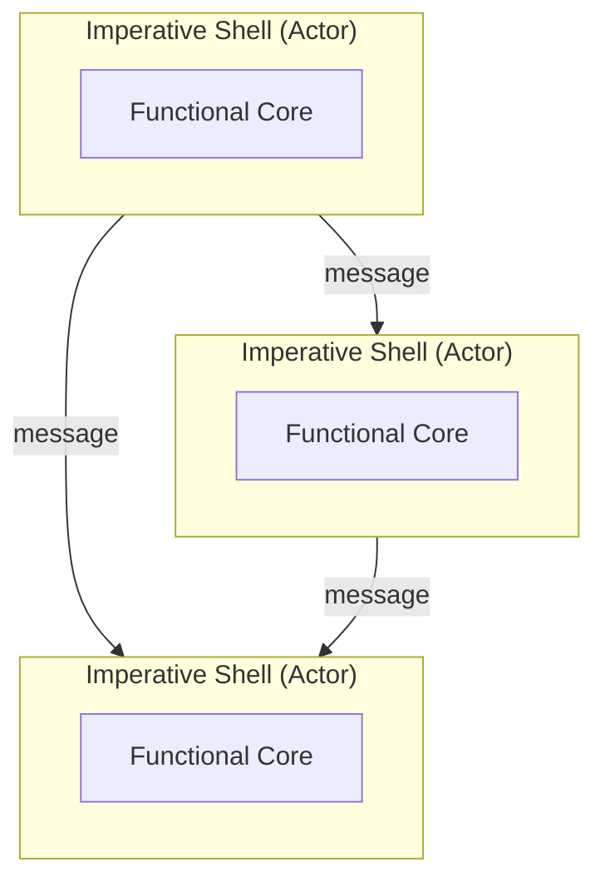
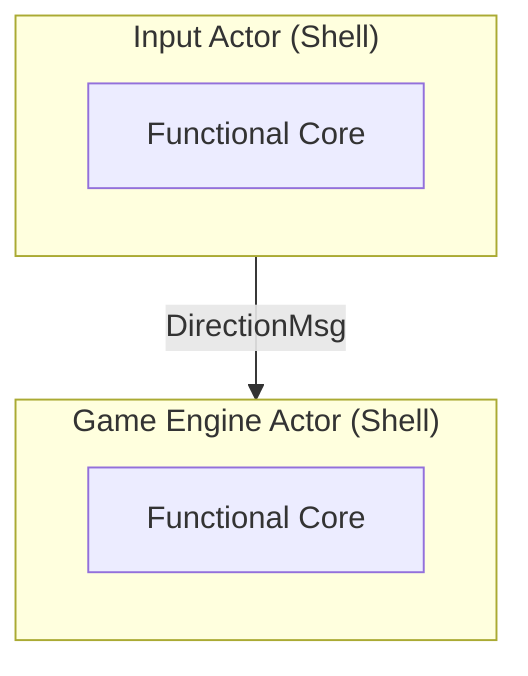

# When One Shell Isn’t Enough: Scaling the Functional Core–Imperative Shell Pattern with Actors in C++

*How to structure growing C++ systems into multiple actor-driven core–shell pairs*

The previous [post](handling-side-effects-in-modern-cpp-interfacing-pure-functions-with-our-imperative-world) showed how the *functional core–imperative shell* pattern decouples the business logic from side effect handling by centralizing all side effects in the shell.

But as the application grows, handling different kinds of side effects (IO, state, timers) for the entire system in a single place quickly becomes problematic: more and more unrelated concerns end up sharing the same context. As a consequence, they can accidentally influence each other, or at least make it harder to see which dependencies actually exist. The shell has to be sorted out again and again, making the code harder to reason about and maintain.

This raises the crucial question: how do we scale the _functional core–imperative shell_ pattern without tying together parts that shouldn't influence each other?

## The Design Idea: Actors as Shell
In order to keep things clean, we need to decouple unrelated shell concerns. Thus, a single shell isn’t enough—we need multiple ones, each handling an independent, non-overlapping subset of side effects.

To fully understand what this means, let’s look at this design from the business logic point of view: effectively, the business logic is split into multiple cores, each with its own shell that handles only the side effects it requires. Thus, the system is structured into multiple core–shell pairs, each forming its own isolated unit around a specific concern. Each unit owns its behavior end-to-end—from handling input effects in its shell, through business logic in the core, to producing output effects via the shell. This is not just splitting the shell, but partitioning the system into smaller, self-contained slices that evolve independently.

One concrete option to put this idea into practice is using the actor model. Actors are inherently separated from each other, so they naturally provide the needed isolation. The approach is simple: combine the actor model with the *functional core–imperative shell* pattern and implement shells as actors. This allows multiple shells to coexist cleanly while still being able to communicate through messages. 




## A Real-World Example
Let’s see this design in action with an example from my [funkysnakes](https://github.com/mahush/funkysnakes/tree/v0.1.0) project. I prototyped [the actor implementation there](https://github.com/mahush/funkyactors/tree/v0.1.0) on top of the [Asio framework](https://github.com/chriskohlhoff/asio). It's quite lean, although it has similar semantics to ROS2 in terms of topic-based message passing. 

Building on this, the *funkysnakes* game implementation is distributed across multiple actors, each following the core–shell pattern as described above.

Let's focus on two actors that are connected by a topic that communicates the `DirectionMsg`, representing a requested direction for the player's snakes.

```cpp
enum class Direction { UP, DOWN, LEFT, RIGHT };

struct DirectionMsg {
	PlayerId player_id;
	Direction direction;
};
```

This message is published by the `InputActor` that is responsible for handling user input once a player presses a direction key.

```cpp
class InputActor : public Actor<InputActor> {
	public:
		InputActor(ActorContext ctx, 
				   TopicPtr<DirectionMsg> direction_topic)
		: Actor{ctx},
		  direction_pub_{create_pub(std::move(direction_topic))} {}
		  
	private:
		void processInputs() {
			while (auto ch = stdin_reader_->tryTakeChar()) {
			    auto [key, new_state] = tryParseKey(*ch, key_parser_state_);
			    key_parser_state_ = new_state;

			    if (key) {
				    auto direction_msg = tryConvertKeyToDirectionMsg(*key);
					if (direction_msg) {
				      direction_pub_.publish(*direction_msg);
					}
			    }
			}
		}
		
		PublisherPtr<DirectionMsg> direction_pub_;
};
```

The `GameEngineActor` receives the `DirectionMsg` message and applies it to its game state `game_state_`. Once the `game_loop_timer_` triggers, the snakes are moved forward based on the latest direction. The processing of actor inputs like messages or timer events is coordinated in the `processInputs` method, which is invoked whenever an input arrives.

```cpp
class GameEngineActor : public Actor<GameEngineActor> {
	public:
		GameEngineActor(ActorContext ctx, 
						TopicPtr<DirectionMsg> direction_topic,
						TimerFactoryPtr timer_factory)
		: Actor(ctx),
		  direction_sub_(create_sub(direction_topic)),
		  game_loop_timer_(create_timer<GameTimer>(timer_factory)) {}
		
		void processInputs() override {
			if (auto direction_msg = direction_sub_.tryTakeMessage()) {
				// applies direction to game_state_ by calling the related pure function of the core here
			}
			
			if (auto elapsed_event = game_loop_timer_.tryTakeElapsedEvent()) {
				// moves snakes forward by calling the related pure function of the core here
			}
		}

	private:
		SubscriptionPtr<DirectionMsg> direction_sub_;
		GameLoopTimerPtr game_loop_timer_;
		GameState game_state_;
};
```

In summary, the `InputActor` asynchronously publishes player direction updates, while the `GameEngineActor` consumes them and evolves the game state each time the game loop timer fires.



## Why this scales
Of course, this modular design comes with some benefits, let's take a closer look:

- **Separation of Concerns: Clear Responsibilities and Boundaries**
	The input handling and game logic are completely decoupled. Each actor focuses on a narrow, well-defined concern. The `DirectionMsg` forms their connection point which is independent of any specific actor, so the modules don’t depend on each other directly—they only agree on a shared data contract. This keeps the boundaries clean and prevents any form of tight coupling.

- **Simplified Reasoning: Isolation**
	Complexity is distributed across multiple isolated shells. Each shell only handles its own side effects, so unrelated parts no longer share the same context and cannot accidentally interfere with each other. The `GameEngineActor` cannot publish direction messages, and the `InputActor` cannot access or modify the game state or the game loop timer. Each part is isolated and can be understood without needing to consider the behavior of the others.

- **Fewer Bugs: Concurrency and Isolation**
	Processing key events and running the game loop happen asynchronously. Key events occur sporadically, while the game loop runs periodically via a timer. Each actor has its own single-threaded execution environment and processes events such as incoming messages or timer expirations sequentially. This eliminates low-level multithreading issues such as data races, because actors do not share mutable state and each actor mutates its state sequentially. Anyone who has spent days debugging low-level multithreading issues knows how valuable such a design is.

- **Better Maintainability: Independent Scaling**
	You can add another input source, such as a Bluetooth controller, without touching the `GameEngineActor`. You can even add it without touching the existing `InputActor`, just adding another actor that publishes a `DirectionMsg` message. Each module evolves independently.

Applying the dependency lens from the [intro post](bridging-object-oriented-and-functional-thinking-in-modern-cpp) gives another perspective on why this design scales: it’s not just the separation itself, but how it constrains dependencies. By isolating actors from each other, all cross-actor dependencies are ruled out upfront except those explicitly expressed through message passing. Without shared state or a shared execution context, message passing is the only way for parts of the system to influence each other. As a result, the system becomes easier to reason about, test, and evolve because fewer parts are able to influence each other.
## Key Advantage: Bridging by Design
There is another very important benefit that goes beyond modularity: The actor-based *functional core–imperative shell* design is able to bridge naturally object-oriented and functional code via inter-actor communication.

This is powerful in practice because the actor boundary lets both styles coexist without forcing the whole system into one paradigm. It's not a compromise—it's straightforward design: you choose which actor should follow which design based on your needs and the architecture just supports that choice. 

## Where we arrived at
The *functional core – imperative shell* pattern scales by partitioning the system into multiple core–shell pairs. This isolates unrelated concerns like input handling and game state evolution, effectively preventing unintended dependencies between them.

Sure, introducing this structure is not for free. The extra abstraction and message passing bring additional complexity that needs to be balanced against the advantages.

However, when that additional structure is justified, you gain valuable isolation that simplifies reasoning and maintenance.

On top of that, it enables clean bridging between traditional object-oriented design and a functional approach. In practice, I’ve found the flexibility to incrementally apply functional design where it makes sense extremely valuable—you might agree.

## Outlook
This and the [previous post](handling-side-effects-in-modern-cpp-interfacing-pure-functions-with-our-imperative-world) touched on state handling, but only at a high level as part of the shell. At the same time, the core needs to read and evolve that state.

Designing clean interfaces for core functions requires a deeper understanding of how state is represented and passed. In the next post, I will take a closer look at state management and how to handle it effectively.

---
Part of the *funkyposts* blog — bridging object-oriented and functional thinking in C++.
Created with AI assistance for brainstorming and improving formulation. Original and canonical source: https://github.com/mahush/funkyposts (v02)