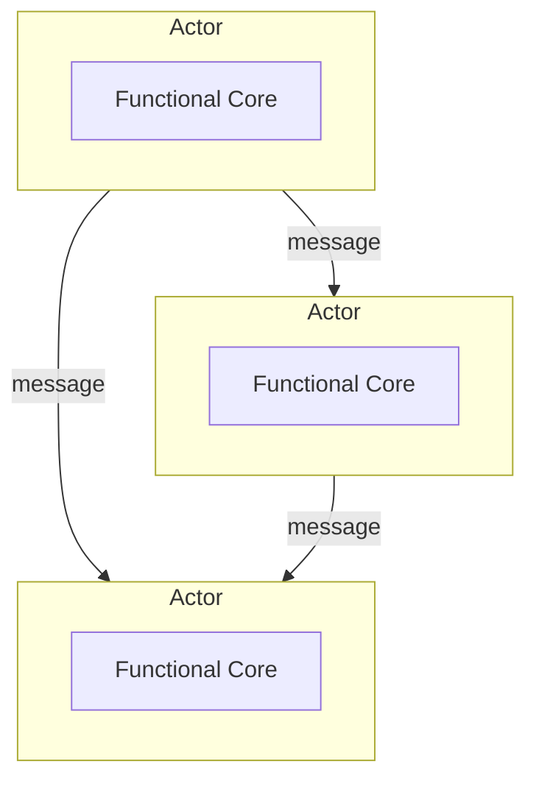
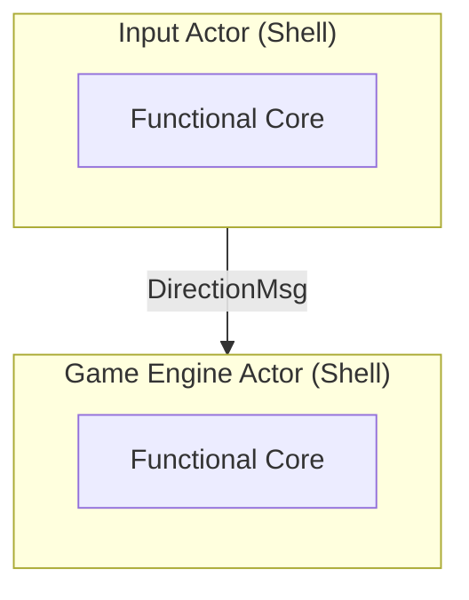

# When One Shell Isn’t Enough: Scaling the Functional Core–Imperative Shell Pattern with Actors in C++

*How to structure growing C++ systems into multiple actor-driven core–shell pairs*

The previous post showed how the *functional core–imperative shell* pattern separates code into a pure part where the business logic is implemented and an effectful part that calls the pure one and handles its side effects. In consequence, the shell must handle all side-effects of the application. 

But as the application grows, handling different kinds of side effects (IO, state, timers) for the entire system in a single place quickly becomes problematic. Too many unrelated concerns end up in one central hub, making the code harder to reason about and maintain.

Which raises the crucial question: how do we scale the *functional core–imperative shell* pattern?

## The Design Idea: Actors as Shell
In order to keep things clean, we need to decouple unrelated shell responsibilities. Thus, a single shell isn’t enough—we need multiple ones, each focusing on a subset of side effects to be handled.

To fully understand what this means, let’s look at this design from the business logic point of view: effectively, the business logic is split into multiple cores, each with its own shell that handles only the side effects it requires.

To put this idea into practice, the actor model is perfectly suited, thanks to its ability to encapsulate state and localize side effects. The idea is simple: combine the actor model with the *functional core–imperative shell* pattern and implement shells as actors. This allows multiple shells to coexist cleanly while still being able to interact easily with one another. 




## A Real-World Example
Let’s see this design in action with an example from my [funkysnakes](https://github.com/mahush/funkysnakes/tree/v0.1.0) project. I prototyped [the actor implementation there](https://github.com/mahush/funkyactors/tree/v0.1.0) on top of the [Asio framework](https://github.com/chriskohlhoff/asio). It's quite lean although it has similar semantics to ROS2 in terms of topic based message passing. 

However, the *funkysnakes* game implementation is distributed across multiple actors, each following the core–shell pattern as described above.

Let's focus on two actors that are connected by a topic that communicates the `DirectionMsg`, representing a requested direction for the player's snakes.

```cpp
enum class Direction { UP, DOWN, LEFT, RIGHT };

struct DirectionMsg {
	PlayerId player_id;
	Direction direction;
};
```

This message is published by the `InputActor` that is responsible for handling user input once a player presses a direction key.

```cpp
class InputActor : public Actor<InputActor> {
	public:
		InputActor(ActorContext ctx, 
					  TopicPtr<DirectionMsg> direction_topic)
		: Actor{ctx},
		  direction_pub_{create_pub(std::move(direction_topic))} {}
		  
	private:
		void processInputs() {
			while (auto ch = stdin_reader_->tryTakeChar()) {
			    auto [key, new_state] = tryParseKey(*ch, key_parser_state_);
			    key_parser_state_ = new_state;

			    if (key) {
				    auto direction_msg = tryConvertKeyToDirectionMsg(*key);
					if (direction_msg) {
				      direction_pub_.publish(*direction_msg);
					}
			    }
			}
		}
		
		PublisherPtr<DirectionMsg> direction_pub_;
};
```

The `GameEngineActor` receives the `DirectionMsg` message and applies it to its game state `game_state_`. Once the `game_loop_timer_` triggers, the snakes are moved forward based on the latest direction. The processing of actor inputs like messages or timer events is coordinated in the `processInputs` method, which is invoked whenever an input arrives.

```cpp
class GameEngineActor : public Actor<GameEngineActor> {
	public:
		GameEngineActor(ActorContext ctx, 
							 TopicPtr<DirectionMsg> direction_topic,
						    TimerFactoryPtr timer_factory)
		: Actor(ctx),
		  direction_sub_(create_sub(direction_topic)),
		  game_loop_timer_(create_timer<GameTimer>(timer_factory)) {}
		
		void processInputs() override {
			if (auto direction_msg = direction_sub_.tryTakeMessage()) {
				// applies direction to game_state_ by calling the related pure function of the core here
			}
			
			if (auto elapsed_event = game_loop_timer_.tryTakeElapsedEvent()) {
				// moves snakes forward by calling the related pure function of the core here
			}
		}

	private:
		SubscriptionPtr<DirectionMsg> direction_sub_;
		GameLoopTimerPtr game_loop_timer_;
		GameState game_state_;
};
```

In summary, the `InputActor` asynchronously publishes player direction updates, while the `GameEngineActor` consumes them and evolves the game state each time the game loop timer fires.



## Why this scales
Of course, this modular design comes with some benefits, let's take a closer look:

- *Separation of Concerns: Clear Responsibilities and Independent Module Interfaces*
	The input handling and game logic are completely decoupled. Each actor has a narrow, focused responsibility. The `DirectionMsg` forms their connection point which is independent of any specific actor, so the modules don’t depend on each other directly—they only agree on a shared data contract. This keeps the boundaries clean and prevents any form of tight coupling.

- *Simplified Reasoning: Localized Complexity*
	Complexity is distributed across multiple shells. Each shell only handles its own side effects. The `GameEngineActor` doesn't care about publishing direction messages, and the `InputActor` doesn't deal with the game state or the game loop timer. Each part remains small and understandable.

- *Fewer Bugs: Concurrency and Isolation*
	Processing key events and running the game loop happen asynchronously. Key events occur sporadically, while the game loop runs periodically via a timer. Each actor has its own single-threaded execution environment and processes events such as incoming messages or timer expirations sequentially. This eliminates low-level multithreading issues such as data races, because there is no shared mutable state and therefore no need for manual synchronization. Anyone who has spent days debugging low-level multithreading issues knows how valuable such a design is.

- *Better Maintainability: Independent Scaling*
  You can add another input source, such as a Bluetooth controller, without touching the `GameEngineActor`. You can even add it without touching the existing `InputActor`, just adding another actor that publishes a `DirectionMsg` message. Each module evolves independently.

## Key Advantage: Bridging by Design
Actually, there is another very important benefit that goes beyond modularity: The actor-based *functional core–imperative shell* design is able to bridge naturally functional and non-functional code via inter-actor communication. So, the same way actors implemented as shell-core pairs can interact with each other they can also interact with actors implemented in traditional OOP design. This is actually game-changing. You can build a single application that combines traditional OOP design with functional design, with clear boundaries between them. It's not a compromise—it's straightforward design: you choose which actor should follow which design based on your needs and the architecture just supports you there. 

## Where we arrived at
The *functional core – imperative shell* pattern scales by structuring the system into multiple core–shell pairs. This decouples unrelated concerns like handling input and advancing game state. In addition, this actor-based separation enables a clean bridge between traditional object-oriented design and a functional approach.

Sure, introducing actors is not for free. The extra abstraction and message passing bring additional complexity that needs to be balanced against the advantages.

However, if you choose this architecture, you get a strong foundation for building modular applications while being able to bridge programming paradigms. In practice, I’ve found the flexibility to incrementally apply functional design where it makes sense extremely valuable—you might agree.

## Outlook
This and the previous post touched on state handling, but only at a high level as part of the shell. At the same time, the core needs to read and evolve that state.

Designing clean interfaces for core functions requires a deeper understanding of the underlying mechanics. In the next post, I will take a closer look at state management and how to handle it effectively.


---
Part of the *funkyposts* blog — Bridging object-oriented and functional thinking in C++ by applying functional thinking to solve real-world C++ design problems—practical, experience-driven, beyond theory. Created with AI assistance for brainstorming and improving formulation. Original and canonical source: https://github.com/mahush/funkyposts (v01)
